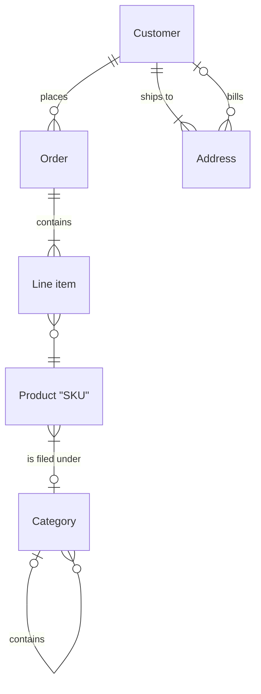
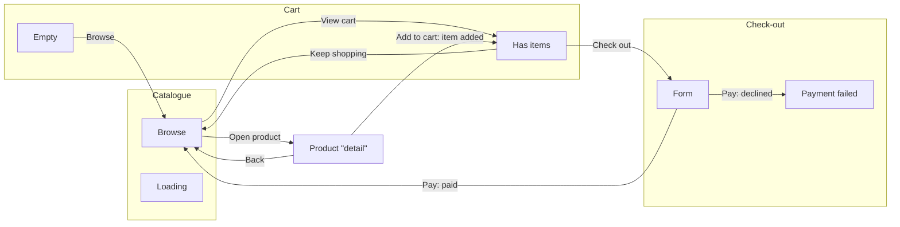

> Generated by modelwright from erd.json, flows.json and config.json — don’t edit; it’s overwritten on every save.

# Shop & Co.

## Data model

### Entities

#### Customer

Someone who has signed up.

| Attribute | Note |
| --- | --- |
| email | unique \| lower-cased |
| full name |  |

#### Order

| Attribute | Note |
| --- | --- |
| placed at |  |
| status | draft, paid or shipped |

#### Line item

No attributes.

#### Product "SKU"

| Attribute | Note |
| --- | --- |
| price |  |

#### Category

| Attribute | Note |
| --- | --- |
| name |  |

#### Address

| Attribute | Note |
| --- | --- |
| line 1 |  |

### Relationships

- Each Customer places zero or more Orders. Each Order belongs to exactly one Customer.
- Each Order contains one or more Line items. Each Line item belongs to exactly one Order.
- Each Line item has exactly one Product "SKU". Each Product "SKU" belongs to zero or more Line items.
- Each Product "SKU" is filed under zero or one Category. Each Category belongs to one or more Product "SKUs".
- Each Category contains zero or more Categories. Each Category belongs to zero or one Category.
- Each Customer ships to one or more Addresses. Each Address belongs to exactly one Customer.
- Each Address bills zero or one Customer. Each Customer belongs to zero or more Addresses.

## Screens and flows

### Catalogue

The home page.

Uses: Product "SKU", Category

#### Browse (default)

Information:

- categories
- product cards

Actions:

- **Open product** → Product "detail"
- **View cart** → Cart › Has items

#### Loading

Information:

- skeleton cards

Actions:

- Nothing yet

### Product "detail"

Information:

- photos
- price \| stock

Actions:

- **Add to cart** → Cart › Has items (item added)
- **Back** → Catalogue › Browse

### Cart

#### Has items (default)

Information:

- line items
- total

Actions:

- **Check out** → Check-out › Form
- **Keep shopping** → Catalogue › Browse

#### Empty

Information:

- Nothing yet

Actions:

- **Browse** → Catalogue › Browse

### Check-out

#### Form (default)

Information:

- address
- card field

Actions:

- **Pay** → Check-out › Payment failed (declined); → Catalogue › Browse (paid)

#### Payment failed

Information:

- error message

Actions:

- **Try again** (dead end)

## Preview

- URL: http://localhost:3000
- Dev command: `pnpm dev --port 3000`
- Devices: Phone (375 × 667), Wide desktop (1440)
