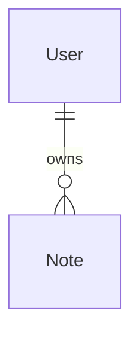
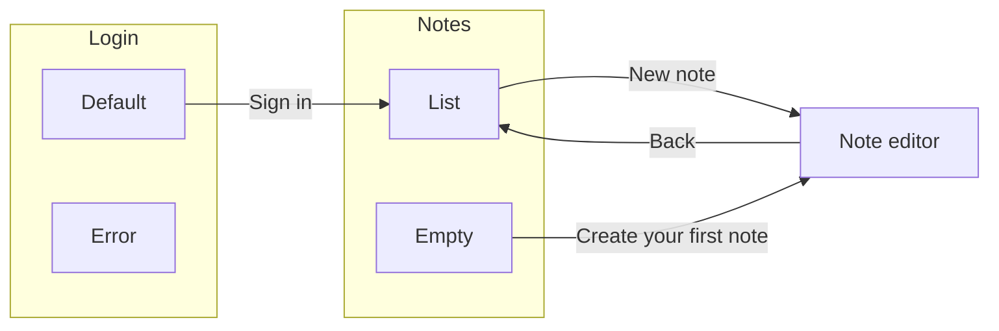

> Generated by modelwright from erd.json, flows.json and config.json — don’t edit; it’s overwritten on every save.

# Notes

## Data model

### Entities

#### User

| Attribute | Note |
| --- | --- |
| email |  |
| display name |  |

#### Note

| Attribute | Note |
| --- | --- |
| title |  |
| body |  |
| updated at | set on every save |

### Relationships

- Each User owns zero or more Notes. Each Note belongs to exactly one User.

## Screens and flows

### Login

#### Default (default)

Information:

- email field
- password field

Actions:

- **Sign in** → Notes › List

#### Error

Information:

- email field
- password field
- error message

Actions:

- **Try again** (dead end)

### Notes

Uses: Note

#### List (default)

Information:

- note titles
- updated dates

Actions:

- **New note** → Note editor
- **Open note** (dead end)

#### Empty

Information:

- empty message

Actions:

- **Create your first note** → Note editor

### Note editor

Uses: Note

Information:

- title field
- body field

Actions:

- **Save** (dead end)
- **Back** → Notes › List

## Preview

- URL: http://localhost:5173
